# Karol Wrona Laboratorium4

<link href="style.css" rel="stylesheet"></link>

- [Karol Wrona Laboratorium4](#karol-wrona-laboratorium4)
  - [Simulated Annealig](#simulated-annealig)
    - [Wstęp teoretyczny](#wstęp-teoretyczny)
    - [Wstęp do kodu źródłowego, główne założenia](#wstęp-do-kodu-źródłowego-główne-założenia)
    - [Kod](#kod)
  - [Zad 1](#zad-1)
    - [Generowanie miast](#generowanie-miast)
    - [SalesmanNode](#salesmannode)
    - [Generowanie Gif](#generowanie-gif)
    - [Multiprocessing](#multiprocessing)
  - [Wyniki Zad1](#wyniki-zad1)
    - [Unifrom distribution:](#unifrom-distribution)
    - [Normal distribution:](#normal-distribution)
    - [Nine spereted areas:](#nine-spereted-areas)
    - [Wnioski](#wnioski)
  - [Zad 2](#zad-2)
    - [BinaryNode](#binarynode)
    - [ColorNode](#colornode)
    - [SmoothColorNode](#smoothcolornode)
    - [Tworzenie Gifów](#tworzenie-gifów)
    - [Klasa Main](#klasa-main)
  - [Wyniki Zad2](#wyniki-zad2)
    - [Simple Square:](#simple-square)
    - [Cross:](#cross)
    - [Horns:](#horns)
    - [Checkerboard:](#checkerboard)
    - [Random:](#random)
    - [Ring:](#ring)
    - [Skos:](#skos)
    - [Big Ring:](#big-ring)
    - [Cross with spaces:](#cross-with-spaces)
    - [Wnioski obrazy czarno-białe](#wnioski-obrazy-czarno-białe)
    - [RGB Repel:](#rgb-repel)
    - [Green Random:](#green-random)
    - [Red Square:](#red-square)
    - [Red ring:](#red-ring)
    - [Red column:](#red-column)
    - [Blue random:](#blue-random)
    - [Blue Horn:](#blue-horn)
    - [Wnioski obrazy RGB](#wnioski-obrazy-rgb)
  - [Zad3](#zad3)
    - [Klasa Sudoku](#klasa-sudoku)
  - [Wyniki zad 3](#wyniki-zad-3)
    - [Sudoku nr 1](#sudoku-nr-1)
    - [Sudoku nr 2](#sudoku-nr-2)
    - [Sudoku nr 3](#sudoku-nr-3)
    - [Wnioski Zad3](#wnioski-zad3)
  - [Program upscaler](#program-upscaler)

Cały kod znajduje się w osobnych plikach, wymagane bibloteki znajdują się w pliku *requirements.txt*. Do uruchomienia kodu wymagana jest wersja Pythona 3.10 lub wyższa.

## Simulated Annealig

### Wstęp teoretyczny

Simulated annealing (symulowane wyżarzanie) jest algorytmem heurestycznym znajdującym minimum lub maximum danej funkcji. Jego nazwa wywodzi się z jego podobieństwa do zjawiska wyżarzania w metalurgi.
W algorytmie kluczową rolę odgrywa paramater zwany temperaturą, który opisuję z jakim prawdopodobieństwiem będziemy akceptować nieoptymalne wartości funkcji. Pozwala nam to uniknąć "utknięcia" w optimum lokalnym funkcji. Wartość temperatury spada z kolejnymi iteracjami, co oznacza, że im dłużej algorytm pracuje tym mniej chętni jesteśmy do akceptowania nieoptymalnych wartości.

### Wstęp do kodu źródłowego, główne założenia

Pochodząc do zadania zdecydowałem, że chciałbym napisać kod w taki sposób, aby dla wszystkich trzech zadań móc korzystać z jednej i tej samej implementacji algorytmu. Dlatego zdecydowałem się skorzystać z filozofi programowania obiektowego. Funkcja implementująca algorytm, poza róźnymi paramatrami przyjmuje obiekt klasy *Node*. W ten sposób trzy różne zadania sprowadzają sie do stoworzenia trzech róznych klas, bez potrzeby modyfikowania samego algorytmu dla każdego z nich.

Tak wygląda klasa *Node*

```Python
class Node(ABC):

    @abstractmethod
    def __init__(self):
        pass

    @abstractmethod
    def getEnergy(self):
        pass

    @abstractmethod
    def neighbour(self, temp):
        pass

    @abstractmethod
    def acceptState(self):
        pass

    @abstractmethod
    def prevState(self):
        pass

    @abstractmethod
    def screenShot(self):
        pass

    @abstractmethod
    def newStartPoint(self):
        pass
```

Opis metod:
- getEnergy: zwraca energie układu
- neighbour: generuje stan sąsiedni
- acceptState: akceptuje stan sąsiedni jako nowy stan
- prevState: odrzuca stan sąsiedni
- screenShot: tworzy kopie węzła aby śledzić działanie programu
- newStartPoint: tworzy nowy węzeł z innym stanem początkowym

Początkowo zamiast metod acceptState i prevState zwracałem nowy obiekt tej samej klasy, jednak w przypadku
zadania drugiego, przepisywanie całej macierzy przy każdej iteracji było zbyt kosztowne a więc musiałem wprowadzić pewne optymalizacje, które zostaną dokładnie opisane w dalszej częsci raportu.

### Kod

```Python
def calcTemperature(startTemp, time, alfa, timeFactor):
    Tk = startTemp*(alfa**(time/timeFactor))
    return Tk

def previewSlope(iterations, startTemp, alfa, timeFactor):
    timeArr = []
    tempArr = []
    for time in range(iterations):
        timeArr.append(time)
        tempArr.append(calcTemperature(startTemp, time, alfa, timeFactor))
    plt.plot(timeArr, tempArr)
    plt.show()

def runSimulations(startingNode, numOfRestarts, startTemp, alfa=0.9, timeFactor=500, probFactor=100, maxIteration=1e4, directory = ""):

    def probability(temp, e1, e2, probFactor):
        if e2 < e1: return 1
        return math.exp(-(abs(e2-e1))/(temp*probFactor))

    def simulatedAnnealing(startTemp, startingNode, alfa, timeFactor, probFactor, maxIteration):
        # used to display plot about cooling rate and energy levels
        timeArr = []
        tempArr = []
        energyArr=[]
        resArray = []
        
        time = 0
        temp = startTemp
        node = startingNode
        mini = float('inf')
        percentage = 0
        while time < maxIteration:
            temp = calcTemperature(startTemp, time, alfa, timeFactor)
            timeArr.append(time)
            tempArr.append(temp)

            e1 = node.getEnergy()
            node.neighbour(temp)
            e2 = node.getEnergy()
            prob = probability(temp, e1, e2, probFactor)
            
            if prob > random.random():
                node.acceptState()
            else:
                node.prevState()
            time += 1
            energyArr.append(node.getEnergy())
            
            if time % (maxIteration//126) == 0:
                resArray.append(node.screenShot())
            if time % (maxIteration//100) == 0:
                percentage += 1
                mini = min(mini, node.getEnergy())
                print(f"done: {percentage}%, temp: {temp}: energy: {node.getEnergy()} dif: {e1-e2}, prob: {prob}, time: {time}")
        resArray.append(node.screenShot())

        fig, axs = plt.subplots(2)
        axs[0].plot(timeArr, tempArr)
        axs[1].plot(timeArr, energyArr)
        plt.savefig(directory + "/" + "plot.png")
        return resArray, node.getEnergy()

    results = []
    bestIteration = -1
    mini = float("inf")
    for i in range(numOfRestarts):
        startingNode = startingNode.newStartPoint()
        resArray, res = simulatedAnnealing(startTemp, startingNode, alfa, timeFactor, probFactor, maxIteration)
        if res < mini:
            mini = res
            bestIteration = i
        results.append(resArray)
    print(f"best res: {mini}")
    return results[bestIteration], mini
```

Główną funkcją jest runSimulations(). Poza oczywistymi argumentami takimi jak startingNode lub numOfRestarts, przyjmuję także kilka parametrów służących do sterowania spadkiem temperatury, a także wartości prawdopodobieństwa. Funkcja spadku temperatury dana jest równaniem Tk = startTemp*(alfa^(time/timeFactor)). Pozwala ona na uzyskanie wykresu który daje dobre wyniki oraz zarazem pozwala na dokładne sterowanie spadkiem temperatury np. gdy zwiększamy ilość iteracji musimy także zwiększyć timeFactor, aby temperatura nie spadła zbyt szybko.

Wartość prawdopodonieństwa zależy od róznicy energi układów, która może przyjmować wartości róznych rzędów wielkości dla różnych zadań. Przydatny jest więc argument probFactor, który pozwala na modyfikowanie wartości prawdopodobieństwa. Funkcja prawdopodobieństwa opisana jest wzorem: P = e^(-(abs(e2-e1))/(temp*probFactor)) dla e2 > e1 oraz P = 1 wpp. Wartość bezwzględna pozwala także na rozwiązanie układów z ujemną energią.

Domyślne argumenty zostały wyznaczone eksperymentalnie, i nie dają dobrych wyników dla każdego typu zadania a więc trzeba zawsze ręcznie dopasować te wartości dla każdego zadania. Przydatna do tego jest funkcją previewSlope(), która pozwala na wyświetlenie jak będzie wyglądał spadek temperatury dla danych ustawień.

Co do głównej części algorytmu to działa on w następujący sposób:
- liczymy energie układu
- generujemy stan sąsiedni (stan sąsiedni jest teraz obecnym stanem)
- liczymy energie stanu sąsiedniego
- decydujemy czy zaakceptować stan (acceptState) czy wrócić do poprzedniego (prevState)

Główna funkcja śledzi także na bieżąco wartości temperatury oraz energi układu, generuje 126 "screenshotów" co pozwala na wygenerowanie 126-klatkowego gifa, oraz informuje ile postępu zostało już wykonane. 

Jeśli numOfRestarts wynosiło więcej niż 1 to na koniec porównujemy uzyskane wyniki i zwracamy najlepszy.

## Zad 1

Problem komiwojażera

### Generowanie miast

```Python
def generateUni(n, width, height):
    points = []
    for _ in range(n):
        x = random.random() * width
        y = random.random() * height
        points.append((x,y))
    return points

def generateNorm(n, loc, mean):
    points = []
    for _ in range(n):
        x = random.normalvariate(loc, mean)
        y = random.normalvariate(loc, mean)
        points.append((x,y))
    return points

def generateSeperated(n, width, height):
    points = []
    sixthWidth = width/9
    sixthHeight = height/9
    groupSize = math.ceil(n/9)
    for i in range(1,9,3):
        for j in range(1,9,3):
            for _ in range(groupSize):
                x = (random.random() + i) * sixthWidth
                y = (random.random() + j) * sixthHeight
                points.append((x,y))
    return points

def seperateList(points):
    xs = [pair[0] for pair in points]
    ys = [pair[1] for pair in points]
    return xs, ys
```

### SalesmanNode

```Python
class SalesmanNode(Node):

    def __init__(self, cities):
        self.cities = cities
        self.stack = []

    def getDist(self, a, b):
        return sqrt((b[0]-a[0])**2+(b[1]-a[1])**2)

    def getEnergy(self):
        dist = 0
        n = len(self.cities)
        for i in range(n-1):
            dist += self.getDist(self.cities[i], self.cities[i+1])
        dist += self.getDist(self.cities[0], self.cities[n-1])
        return dist

    def neighbour(self, temp):
        n = len(self.cities)
        i = random.randint(0,n-1)
        while 1:
            j = random.randint(0, n-1)
            if j != i:
                break
        self.cities[i], self.cities[j] = self.cities[j], self.cities[i]
        self.stack.append((i,j))

    def acceptState(self):
        self.stack.pop()

    def prevState(self):
        i,j = self.stack.pop()
        self.cities[i], self.cities[j] = self.cities[j], self.cities[i]

    def screenShot(self):
        newCities = copy.deepcopy(self.cities)
        return SalesmanNode(newCities)

    def newStartPoint(self):P
        n = len(self.cities)
        cities = copy.deepcopy(self.cities)
        for _ in range(n*10):
            i = random.randint(0,n-1)
            while 1:
                j = random.randint(0, n-1)
                if j != i:
                    break
            cities[i], cities[j] = cities[j], cities[i]
        newNode = SalesmanNode(cities)
        return newNode

    def __str__(self):
        return str(self.cities)
```

Najciekawszym fragmentem kodu jest zmienna *stack*. Za każdym razem gdy wykonujemy zmianę miejscami dwóch miast, to wrzucamy ich indeksy na stos. W ten sposób funkcja prevState() pozwala wrócić do poprzedniego stanu bez kopiowania całej tablicy cities. 

Stany pośrednie generujemy za pomocą zmiany miejscami dwóch miast.

### Generowanie Gif

Tak wygląda kod odpowiedzialny za generowanie gifów dla zad1

```Python
def createGif(nodes, name):

    def createCityGraph(node):
        G = nx.Graph()
        i = 0
        for city in node.cities:
            G.add_node(i, cord = city)
            i += 1
        n = len(node.cities)
        for i in range(n-1):
            G.add_edge(i, i+1)
        G.add_edge(0, n-1)
        return G

    def plotCityGraph(G, name):
        fig, ax = plt.subplots(figsize=(8, 8))
        # ax.set_facecolor('#95A4AD')
        pos = nx.get_node_attributes(G, "cord")
        nx.draw_networkx(G, pos, node_size=14, with_labels=False)
        plt.savefig(name)
        plt.close()

    fileNames = []
    n = len(nodes)
    for i in range(n):
        G = createCityGraph(nodes[i])
        plotCityGraph(G, f"./{name}/{i}.png")
        fileNames.append(f"./{name}/{i}.png")
    name = name + "/" + name + ".gif"
    with imageio.get_writer(name, mode='I') as writer:
        for filename in fileNames:
            image = imageio.imread(filename)
            writer.append_data(image)
```
### Multiprocessing

Ze względu na to, że zadanie drugie okazało się być bardzo wymagające obliczeniowo, musiałem zastosować wiele optymalizacji aby móc uzyskać satysfakcjonujące wyniki w sensownym czasie. Dlatego postanowiłem zastosować Multiprocessing, który pozwala stworzyć wiele procesów Pythona naraz. Ponieważ multiprocessing w przeciwieństwie do multithreadingu (na który Python o ile wiem zbytnio nie pozwala ze względu na GIL) nie jest w stanie w prosty sposób przekazać pamięci do procesów potomnych, implementacja tego rozwiązania jest nieco toporna, składa się ona z osobnego pliku zad1Multiprocessing.py oraz konstrukcji match-case w głównym pliku zadania 1. Ale najważniejsze, że działa i pozwala skrócić czas oczekiwania o 6-7 razy.

main(x) w zad1

```Python
def main(x):
    match x:
        case 1:
            name = "uni" + str(random.randint(0,9000000))
            os.system("mkdir "+name)

            points = generateUni(80, 100, 100)
            startingNode = SalesmanNode(points)
            # previewSlope(1000000,1,0.9,20000)
            resArray,bestRes = runSimulations(startingNode, 5, 1, maxIteration=1e6, timeFactor=30000, probFactor=8, directory=name)
            createGif(resArray, name)
        case 2:
            name = "norm" + str(random.randint(0,9000000))
            os.system("mkdir "+name)

            points = generateNorm(64, 100, 100)
            startingNode = SalesmanNode(points)
            resArray,bestRes = runSimulations(startingNode, 5, 1, maxIteration=1e6, timeFactor=30000, probFactor=8, directory=name)
            createGif(resArray, name)
        case 3:
            name = "seperated" + str(random.randint(0,9000000))
            os.system("mkdir "+name)

            points = generateUni(64, 100, 100)
            startingNode = SalesmanNode(points)
            resArray,bestRes = runSimulations(startingNode, 5, 1, maxIteration=1e6, timeFactor=30000, probFactor=8, directory=name)
            createGif(resArray, name)
```

zad1Multiprocessing

```Python
if __name__=="__main__":
    from zad1 import main
    from multiprocessing import *

    for i in range(1,4):
        p = Process(target=main, args=(i,))
        p.start()
```

## Wyniki Zad1

Do uzyskania wyników użyłem następujących opcji

- Iterations = 10e6
- restarts = 5
- startingTemp = 1
- timeFactor = 30000
- probFactor = 8

### Unifrom distribution:

80 Miast

Wykres energi i temperatury

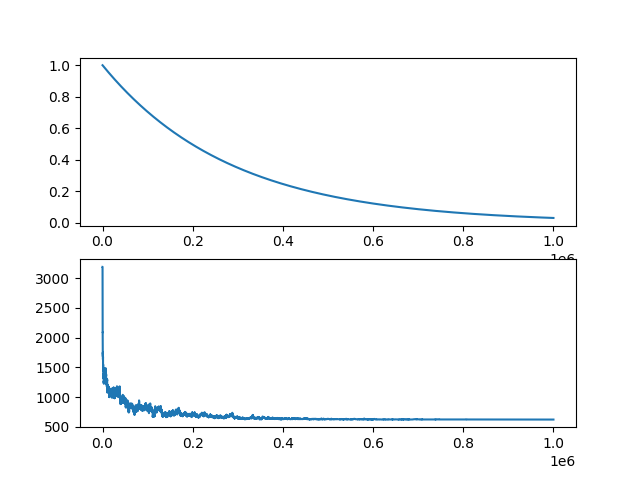

<div class="card">

<figure>
    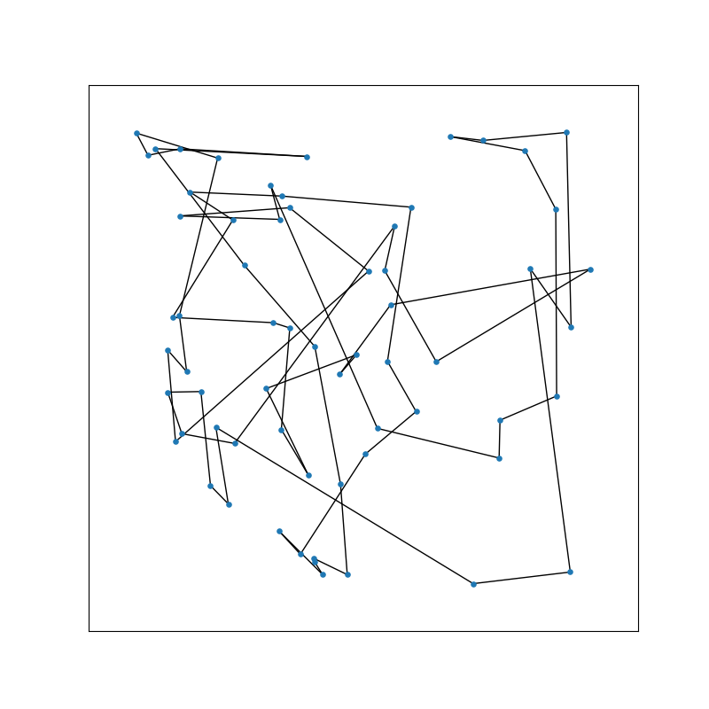
    <figcaption>Stan początkowy</figcaption>
</figure>

<figure>
    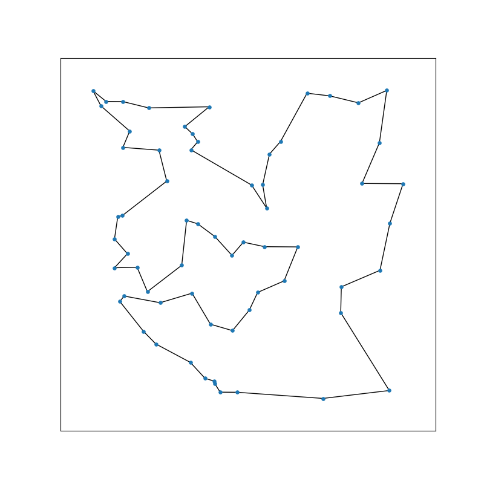
    <figcaption>Stan końcowy</figcaption>
</figure>

<figure>
    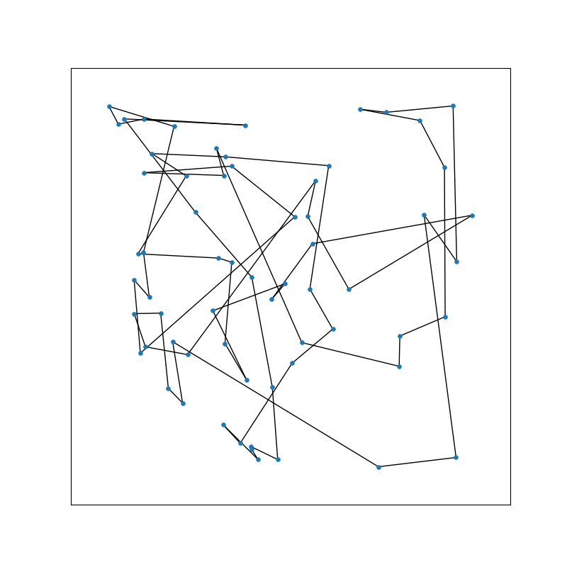
    <figcaption>GIF</figcaption>
</figure>

</div>

### Normal distribution:

64 Miasta

Wykres energi i temperatury

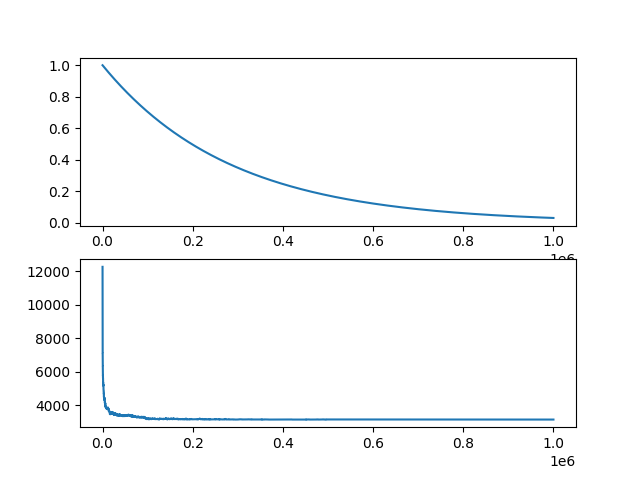

<div class="card">

<figure>
    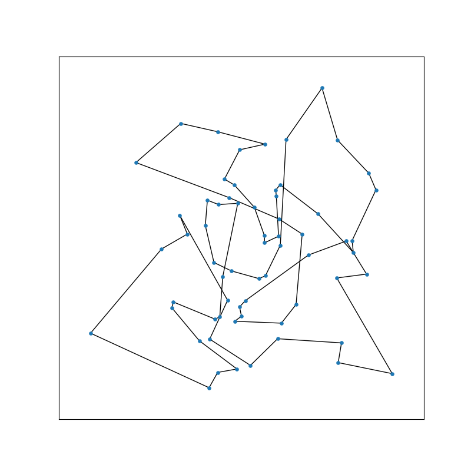
    <figcaption>Stan początkowy</figcaption>
</figure>

<figure>
    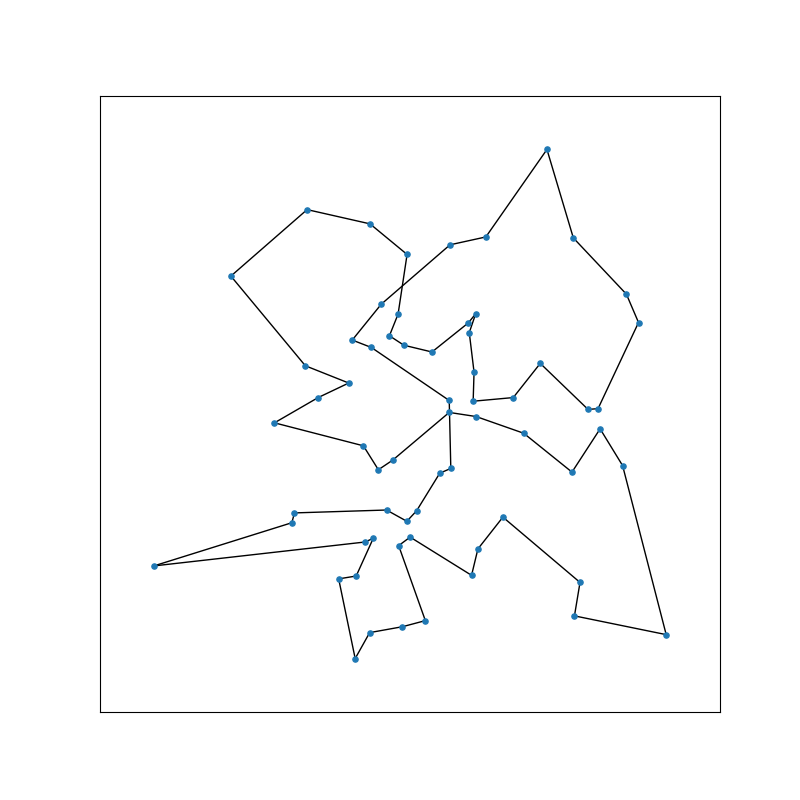
    <figcaption>Stan końcowy</figcaption>
</figure>

<figure>
    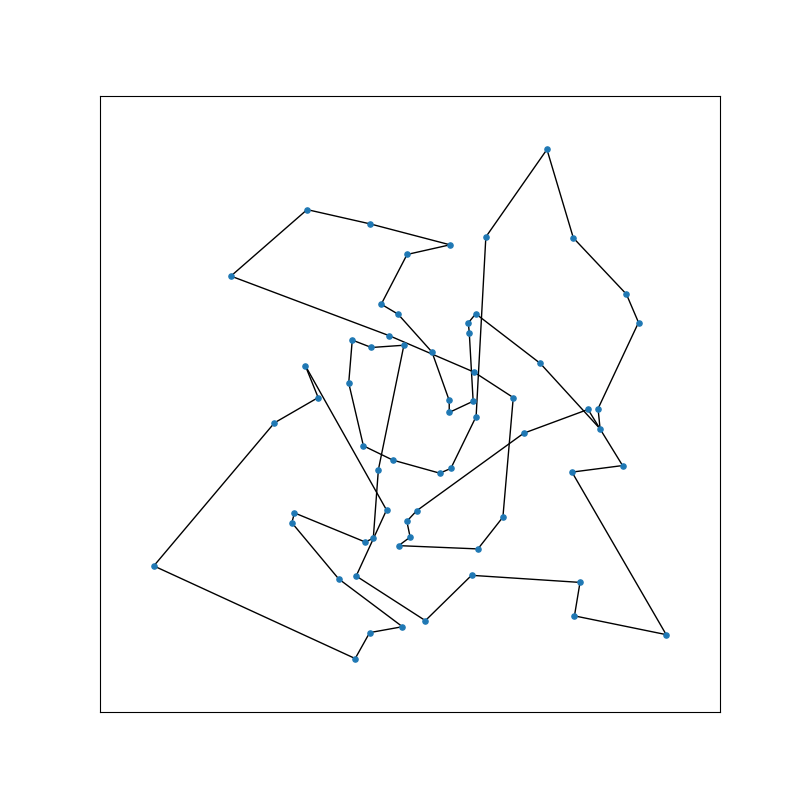
    <figcaption>GIF</figcaption>
</figure>

</div>

### Nine spereted areas:

64 Miasta

Wykres energi i temperatury

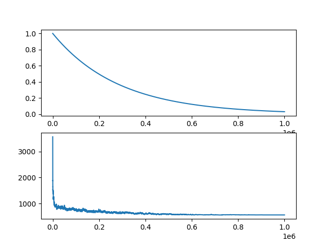

<div class="card">

<figure>
    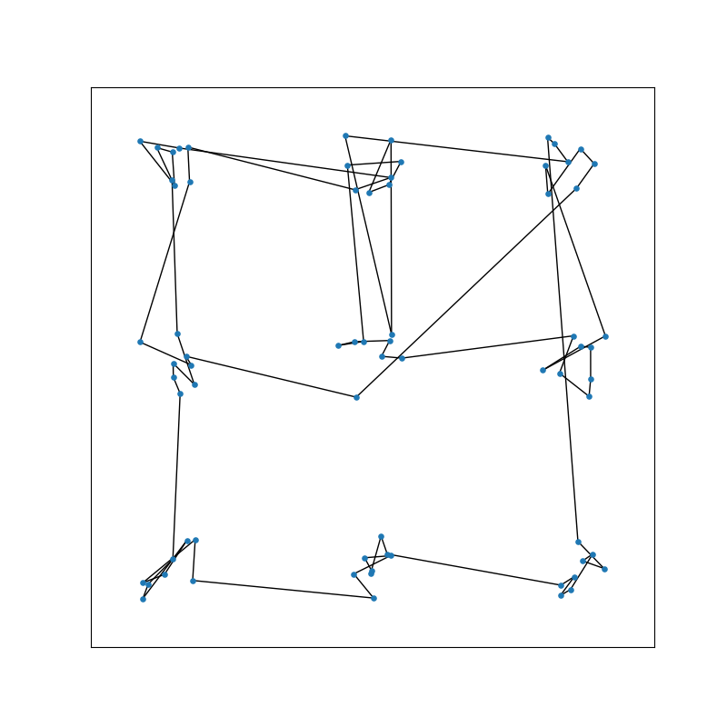
    <figcaption>Stan początkowy</figcaption>
</figure>

<figure>
    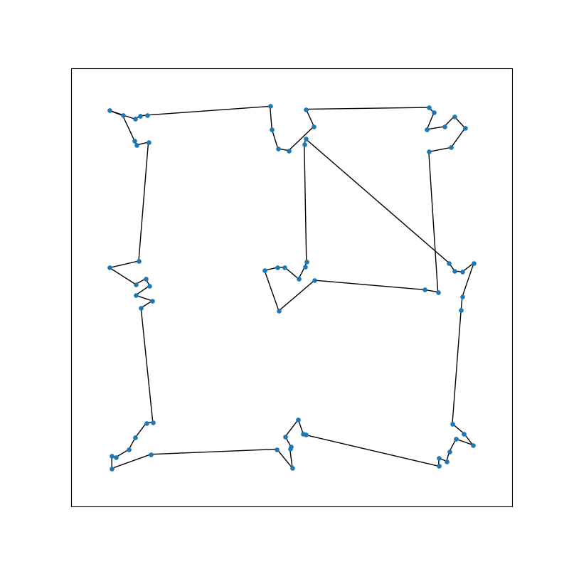
    <figcaption>Stan końcowy</figcaption>
</figure>

<figure>
    
    <figcaption>GIF</figcaption>
</figure>

</div>

### Wnioski

Jak widać algorytm wyznacza zdecydowanie krótszą trasę niż w stanie początkowym. Mimo, że nie jest to idealna trasa można uznać, że jest ona wystarczająco dobra a więc, że algorytm działa poprawnie. Widać także, że milion iteracji to zdecydowanie zbyt dużo gdyż największe spadki energi miały miejsce na samym początku trwania programu.

## Zad 2

### BinaryNode

Oto najbardziej skomplikowany kod w całym zadaniu.

```Python
class BinaryNode(Node):
    
    def getRadious(self):
        maxi = -1
        for offset in self.offsets:
            maxi = max(maxi, abs(offset[0]))
            maxi = max(maxi, abs(offset[1]))
        return maxi

    def __init__(self, width, height, delta=0, offsets=[(-1,0),(1,0),(0,1),(1,0),(1,1),(-1,-1),(-1,1),(1,-1)], amount=0.01, reverseForce = False):
        self.width = width
        self.height = height
        self.delta = delta
        self.offsets = offsets
        self.amount = amount
        self.radious = self.getRadious()
        self.stack = []
        # affectedSet - set of points affected by swap
        # swapSet - points to be swapped after choosing them in loop in neighbour()
        self.affectedSet = set({})
        self.swapSet = set({})
        # change if black points atrract or repel each other
        self.reverseForce = reverseForce
        
        self.points = [[0 for _ in range(width)] for _ in range(height)]

        self.numOfPoints = math.floor(width*height*delta)
        for _ in range(self.numOfPoints):
            while 1:
                x = random.randint(0,width-1)
                y = random.randint(0,height-1)
                if self.points[x][y] != 0:
                    continue
                self.points[x][y] = 1
                break

        self.oldEnergy = self.initEnergy()
        self.currEnergy = self.initEnergy()

    def initEnergy(self):
        energy = 0
        for i in range(self.width):
            for j in range(self.height):
                energy += self.energyOfPoint(i,j)
        return energy

    def energyOfPoint(self, x, y):
        energy = 0
        if self.points[x][y] == 0:
            return energy
        for offset in self.offsets:
            newX = (x + offset[0]) % self.width
            newY = (y + offset[1]) % self.height
            if self.reverseForce == False:
                if self.points[newX][newY] != 0:
                    energy += 1
            else:
                if self.points[newX][newY] != 0:
                    energy -= 1
        return energy

    def deleteEnergy(self):
        test = 0
        localSet = copy.deepcopy(self.affectedSet)
        while len(localSet) != 0:
            point = localSet.pop()
            self.currEnergy -= self.energyOfPoint(point[0], point[1])
            test += self.energyOfPoint(point[0], point[1])

    def addEnergy(self):
        localSet = copy.deepcopy(self.affectedSet)
        while len(localSet) != 0:
            point = localSet.pop()
            self.currEnergy += self.energyOfPoint(point[0], point[1])


    def getEnergy(self):
        return self.currEnergy

    def getPointsInRadious(self, x, y):
        res = []
        for i in range(-self.radious, self.radious+1):
            for j in range(-self.radious, self.radious+1):
                newX = (x+i)%self.width
                newY = (y+j)%self.height
                res.append((newX, newY))
        return res


    def addToAffectedSet(self, vicinity):
        for point in vicinity:
            self.affectedSet.add(point)

    def neighbour(self, temp):
        # toSwap = math.floor(self.numOfPoints*self.amount)
        if temp > 0.4:
            toSwap = math.floor(self.numOfPoints*(0.02))
        else:
            toSwap = math.floor(self.numOfPoints*self.amount)

        self.oldEnergy = self.currEnergy
        
        for _ in range(toSwap):
            x1 = random.randint(0,self.width-1)
            y1 = random.randint(0,self.height-1)
            x2 = random.randint(0,self.width-1)
            y2 = random.randint(0,self.height-1)
            pointVicinity1 = self.getPointsInRadious(x1, y1)
            pointVicinity2 = self.getPointsInRadious(x2, y2)
            self.addToAffectedSet(pointVicinity1)
            self.addToAffectedSet(pointVicinity2)
            self.swapSet.add((x1,y1,x2,y2))
        
        self.deleteEnergy()
        while len(self.swapSet) != 0:
            x1,y1,x2,y2= self.swapSet.pop()
            self.points[x1][y1], self.points[x2][y2] = self.points[x2][y2], self.points[x1][y1]
            self.stack.append((x1,y1,x2,y2))

        self.addEnergy()
        self.affectedSet.clear()
        self.swapSet.clear()

    def acceptState(self):
        while self.stack != []:
            self.stack.pop()

    def prevState(self):
        self.currEnergy = self.oldEnergy
        while self.stack != []:
            x1,y1,x2,y2 = self.stack.pop()
            self.points[x1][y1], self.points[x2][y2] = self.points[x2][y2], self.points[x1][y1]

    def screenShot(self):
        matrix = np.zeros((self.height,self.width,3), np.uint8)
        for i in range(self.width):
            for j in range(self.height):
                if self.points[i][j] == 0:
                    matrix[i,j] = (255,255,255)
                else:
                    matrix[i,j] = (0,0,0)
        return matrix

    def newStartPoint(self):
        return BinaryNode(self.width, self.height, self.delta, self.offsets, self.amount)
```
Jak wcześniej wspomniałem to zadanie okazało się niezywkle trudne obliczeniowo, dlatego musiałem zastosować kilka różnych optymalizacji, zrozumienie ich pozwoli na lepsze zrozumienie kodu.
Pierwszą już wcześniej opisną optymalizacją jest skorzystanie z stosu aby nie musieć przepisywać całej macierzy punktów. Drugą ważną optymalizacją jest zrezygnowanie z liczenia całej energi układu poprzez sprawdzanie sąsiedztw wszystkich punktów. Dużo lepszym rozwiązaniem jest liczenie energi dla tych punktów, których energia mogła się zmienić po wygenerowaniu nowego stanu. Do obliczenia obszaru który trzeba zbadać po zamianie dwóch punktów wykorzystuję funkcję getRadious(), która wyznacza kwadrat zawierający wszystkie punkty, których energia mogła się zmienić. I tutaj warto zauważyć, że dla małej mapy i sąsiedztwa które zawiera mało punktów ale bardzo oddalonych od komórki dla której liczymy energie, to ta optymalizacja na niewiele się zda. Można to rozwiązać tworząc drugą mape *offSetów* stworzoną w taki sposób, że interesujący nas kwadrat traktujemy jak jeden z punktów sąsiedztwa i do *affectedSet* zapisujemy centrum tego "nowego" sąsiędztwa. Wracając jednak do faktycznej wersji kodu to w dalszych krokach każdy punkt, który trzeba zbadać dodajemy do *affectedSet* a każdy punkt, który zamieniamy dodajemy do *swapSet*. Następnie usuwamy energie z punktów w *affectedSet*, zamieniamy punkty z *swapSet* i liczymy energie na nowo dla punktów z *affectedSet*. W ten sposób w znaczny sposób zmniejszamy ilość wywołań funkcji *energyOfPoint()*. Oczywiście możemy wrócić do poprzedniej energi oraz stanu za pomocą *prevState()*.

Domyślnie dla każdego czarnego punktu w sąsiedztwie innego czarnego punktu energia potencjalna rośnie. Ponieważ dążymy do znalezienia minimum, to można interpretować to zachowanie tak jakby czarne punkty się odpychały od siebie. Zachowanie to można zmienić za pomocą atrybutu reverseForce.

Stan sąsiedni generowany jest poprzez zamiane *amount* punktów. Jednak zauważyłem, że lepsze rezultaty otrzymuję gdy zamieniam większą ilość punktów gdy układ jest rozgrzany, dlatego dla *temp* > 0.4. Zamieniam 20 razy więcej punktów.

### ColorNode

Zdecydowałem się też zbadać jak zachowałby się 3 kolorowe piksele, z kwadratowym sąsiedztwem z zasadami takimi, że: 
- Czerwone i Zielone piksele się przyciągają
- Niebieski odpycha każdy inny piksel
- Piksele tego samego koloru się przyciągają

Do tego użyłem klasy ColorNode

```Python
class ColorNode(BinaryNode):

    def __init__(self, width, height, delta=0, offsets=[(-1,0),(1,0),(0,1),(1,0),(1,1),(-1,-1),(-1,1),(1,-1)], amount=0.01):
        BinaryNode.__init__(self, width, height, delta, offsets, amount)
        
        for i in range(height):
            for j in range(width):
                self.points[j][i] = 0

        for _ in range(self.numOfPoints):
            while 1:
                x = random.randint(0,width-1)
                y = random.randint(0,height-1)
                color = random.randint(1,2)
                if self.points[x][y] != 0:
                    continue
                self.points[x][y] = color
                break

    def energyOfPoint(self, x, y):
        # R = 0, G = 1, B = 2
        energy = 0
        color = self.points[x][y]
        for offset in self.offsets:
            newX = (x + offset[0]) % self.width
            newY = (y + offset[1]) % self.height
            # te same sie przyciagaja inne odpychaja
            # czerwony odpycha, niebieski i zielony sie przyciągają
            if self.points[newX][newY] == color:
                energy -= 1
            elif self.points[newX][newY] == 0 or color == 0:
                energy += 1
            elif self.points[newX][newY] == 1 and color == 2:
                energy -= 1
            elif self.points[newX][newY] == 2 and color == 1:
                energy -= 1
        return energy

    def screenShot(self):
        matrix = np.zeros((self.height,self.width,3), np.uint8)
        for i in range(self.height):
            for j in range(self.width):
                color = self.points[i][j]
                # z jakiegoś powodu (0,0,255) to czerwony a nie niebieski
                match color:
                    case 0:
                        matrix[i,j] = (0,0,255)
                    case 1:
                        matrix[i,j] = (0,255,0)
                    case 2:
                        matrix[i,j] = (255,0,0)
        return matrix

    def newStartPoint(self):
        return ColorNode(self.width, self.height, self.delta, self.offsets, self.amount)
```

### SmoothColorNode

Ostatnią klasą jest SmoothColorNode. Składa się ona z pikseli o róznej saturacji danego koloru np. czerwone piksele z wartościami od 0 do 255 dla koloru czerwonego w RGB. Im bardziej podobne do siebie są piksele tym mocniej się przyciągają np. (255,0,0) przyciąga (200,0,0) mocniej niż (100,0,0).

```Python
class SmoothColorNode(BinaryNode):
    
    def __init__(self, width, height, delta=0, offsets=[(-1,0),(1,0),(0,1),(1,0),(1,1),(-1,-1),(-1,1),(1,-1)], amount=0.01, displayColor="green"):
        BinaryNode.__init__(self, width, height, delta, offsets, amount)
        self.displayColor = displayColor

        for i in range(height):
            for j in range(width):
                self.points[j][i] = 0

        for _ in range(self.numOfPoints):
            while 1:
                x = random.randint(0,width-1)
                y = random.randint(0,height-1)
                color = random.randint(0,255)
                if self.points[x][y] != 0:
                    continue
                self.points[x][y] = color
                break

    def energyOfPoint(self, x, y):
        energy = 0
        color = self.points[x][y]
        # if color == 0:
        #     return 0
        for offset in self.offsets:
            newX = (x + offset[0]) % self.width
            newY = (y + offset[1]) % self.height
            # podobne kolory się przyciągają
            energy += abs(self.points[newX][newY] - color)
        return energy

    def screenShot(self):
        matrix = np.zeros((self.height,self.width,3), np.uint8)
        for i in range(self.width):
            for j in range(self.height):
                color = self.points[i][j]
                match self.displayColor:
                    case("green"):
                        matrix[i,j] = (0,color,0)
                    case("blue"):
                        matrix[i,j] = (color,0,0)
                    case("red"):
                        matrix[i,j] = (0,0,color)
        return matrix

    def newStartPoint(self):
        return SmoothColorNode(self.width, self.height, self.delta, self.offsets, self.amount, displayColor=self.displayColor)
```

### Tworzenie Gifów

```Python
def createGif(nodes, name):
    fileNames = []
    n = len(nodes)
    for i in range(n):
        cv2.imwrite(f"./{name}/{i}.png", nodes[i])
        fileNames.append(f"./{name}/{i}.png")
    name = name + "/" + name + ".gif"
    with imageio.get_writer(name, mode='I') as writer:
        for filename in fileNames:
            image = imageio.imread(filename)
            writer.append_data(image)
```

### Klasa Main

Tak wygląda przykładowa klasa main przygtowana na jedną z długich nocy, podczas których algorytm ciężko pracował by wygenerować ciekawe obrazy. 

```Python
def main(x):
    match x:
        case(1):
            # cross
            name = "cross" + str(random.randint(0,9000000))
            os.system("mkdir "+name)
            startingNode = BinaryNode(48,48,0.5,amount=0.003, offsets=[(-1,0),(1,0),(0,1),(1,0)])
            resArray, bestRes = runSimulations(startingNode, 5, 1, maxIteration=1000000, timeFactor=17500, probFactor=20, directory=name)
            createGif(resArray, name)
        case(2):
            # rogi
            name = "rogi" + str(random.randint(0,9000000))
            os.system("mkdir "+name)
            startingNode = BinaryNode(48,48,0.5,amount=0.003, offsets=[(1,1),(-1,-1),(-1,1),(1,-1)])
            resArray, bestRes = runSimulations(startingNode, 5, 1, maxIteration=1000000, timeFactor=17500, probFactor=20, directory=name)
            createGif(resArray, name)
        case(3):
            #skos
            name = "skos" + str(random.randint(0,9000000))
            os.system("mkdir "+name)
            startingNode = BinaryNode(48,48,0.5,amount=0.003, offsets=[(-1,-1),(1,1)])
            resArray, bestRes = runSimulations(startingNode, 5, 1, maxIteration=1000000, timeFactor=17500, probFactor=20, directory=name)
            createGif(resArray, name)
        case(4):
            # pierscien
            name = "pierscien" + str(random.randint(0,9000000))
            os.system("mkdir "+name)
            pattern = [(-2,-2),(-1,2),(0,2),(1,2),(2,2),(2,1),(2,0),(2,-1),(2,-2),(1,-2),(0,-2),(-1,-2),(-2,-2),(-2,-1),(-2,0),(-2,1),(-2,2)]
            startingNode = BinaryNode(48,48,0.5,amount=0.003, offsets=pattern)
            resArray, bestRes = runSimulations(startingNode, 5, 1, maxIteration=1000000, timeFactor=17500, probFactor=20, directory=name)
            createGif(resArray, name)
        case(5):
            # szachownica
            name = "szachownica" + str(random.randint(0,9000000))
            os.system("mkdir "+name)
            pattern = [(-1,-1),(-1,1),(1,-1),(1,1),(-2,2),(2,2),(2,-2),(-2,-2),(2,0),(-2,0),(0,-2),(0,2)]
            startingNode = BinaryNode(48,48,0.5,amount=0.003,offsets=pattern)
            resArray, bestRes = runSimulations(startingNode, 5, 1, maxIteration=1000000, timeFactor=17500, probFactor=20, directory=name)
            createGif(resArray, name)
        case(6):
            # random
            name = "random" + str(random.randint(0,9000000))
            os.system("mkdir "+name)
            pattern = [(2,0),(-1,2),(2,3),(-2,-1),(0,-2)]
            startingNode = BinaryNode(48,48,0.5,amount=0.003, offsets=pattern)
            resArray, bestRes = runSimulations(startingNode, 5, 1, maxIteration=1000000, timeFactor=17500, probFactor=20, directory=name)
            createGif(resArray, name)
```

## Wyniki Zad2

Do uzyskania wyników użyłem następujących opcj:

- Iterations = 10e6
- restarts = 5
- startingTemp = 1
- timeFactor = 17500
- probFactor = 20

### Simple Square:

Sąsiedztwo:

```
X X X
X @ X
X X X
```

Wykres energi i temperatury

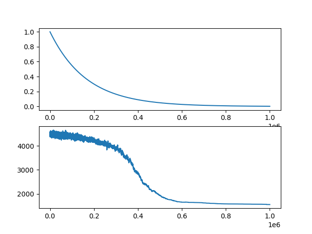

<div class="card">

<figure>
    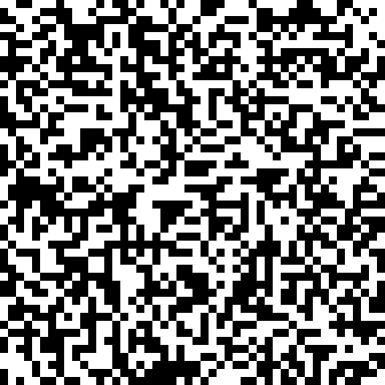
    <figcaption>Stan początkowy</figcaption>
</figure>

<figure>
    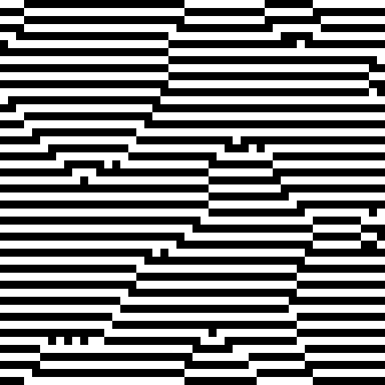
    <figcaption>Stan końcowy</figcaption>
</figure>

<figure>
    
    <figcaption>GIF</figcaption>
</figure>

</div>

Jak widać dostajemy bardzo dokładny obraz z lekkimi zaburzeniami, które jednak lokalnie dalej zachowują wzór.

### Cross:

Sąsiedztwo:

```
O X O
X @ X
O X O
```

Wykres energi i temperatury

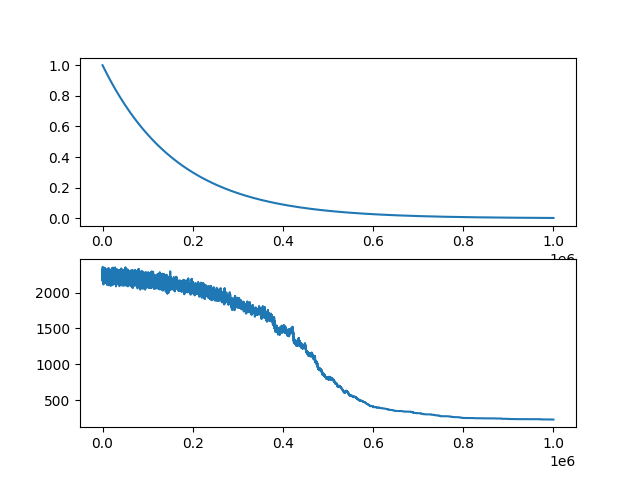

<div class="card">

<figure>
    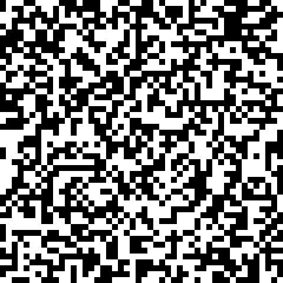
    <figcaption>Stan początkowy</figcaption>
</figure>

<figure>
    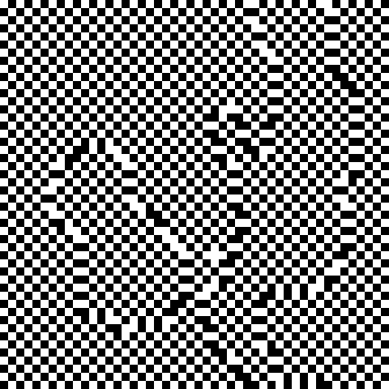
    <figcaption>Stan końcowy</figcaption>
</figure>

<figure>
    
    <figcaption>GIF</figcaption>
</figure>

</div>

### Horns:

Sąsiedztwo:

```
X O X
O @ O
X O X
```

Wykres energi i temperatury


<div class="card">

<figure>
    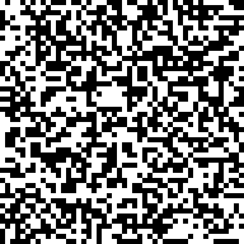
    <figcaption>Stan początkowy</figcaption>
</figure>

<figure>
    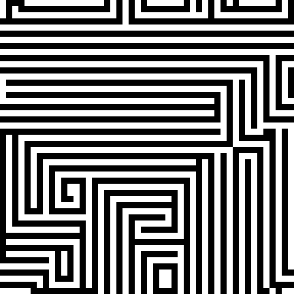
    <figcaption>Stan końcowy</figcaption>
</figure>

<figure>
    
    <figcaption>GIF</figcaption>
</figure>

</div>

### Checkerboard:

Sąsiedztwo:

```
X O X O X
O X O X O
X O @ O X
O X O X O
X O X O X
```

Wykres energi i temperatury


<div class="card">

<figure>
    
    <figcaption>Stan początkowy</figcaption>
</figure>

<figure>
    
    <figcaption>Stan końcowy</figcaption>
</figure>

<figure>
    
    <figcaption>GIF</figcaption>
</figure>

</div>

Otrzymujemy bardzo ciekawy obraz, który ma ciekawy wzór w poziome paski o grubości 2 lub 3 piksele, paski te są jednak mocno zaburzone.

### Random:

Sąsiedztwo:

```
O O O O O X O
O O X O O O O
O O O O O O O
O O O @ O X O
O X O O O O O
O O O X O O O
O O O O O O O
```

Wykres energi i temperatury

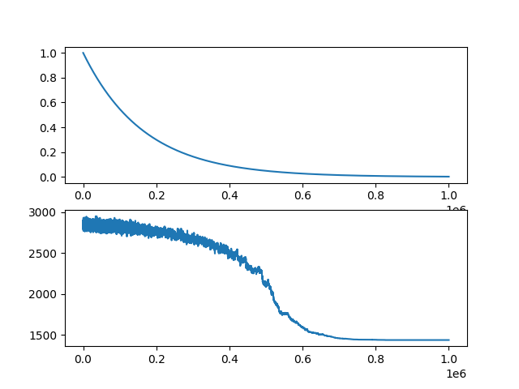

<div class="card">

<figure>
    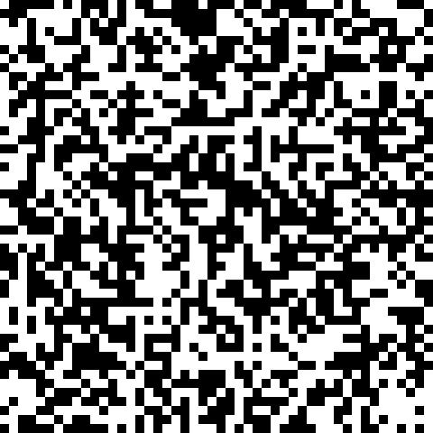
    <figcaption>Stan początkowy</figcaption>
</figure>

<figure>
    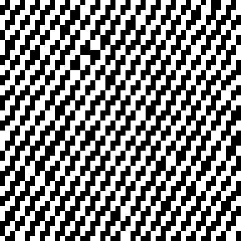
    <figcaption>Stan końcowy</figcaption>
</figure>

<figure>
    
    <figcaption>GIF</figcaption>
</figure>

</div>

### Ring:

Sąsiedztwo:

```
X X X X X
X O O O X
X O @ O X
X O O O X
X X X X X
```

Wykres energi i temperatury

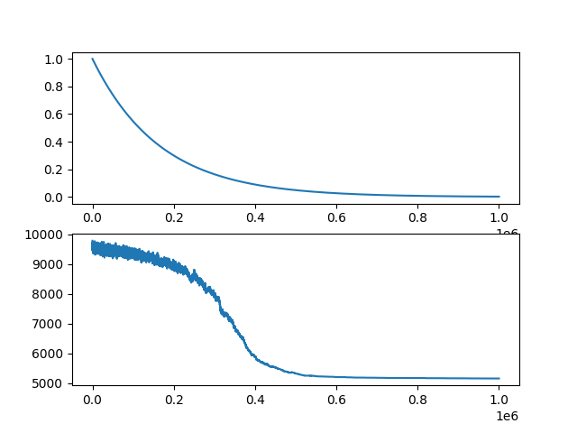

<div class="card">

<figure>
    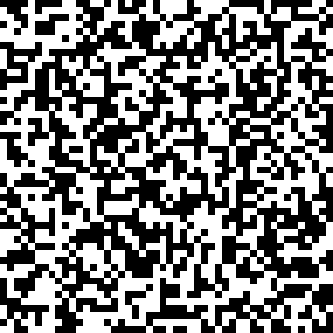
    <figcaption>Stan początkowy</figcaption>
</figure>

<figure>
    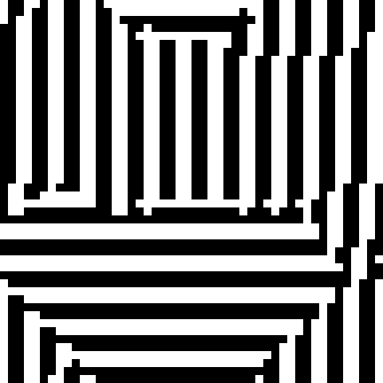
    <figcaption>Stan końcowy</figcaption>
</figure>

<figure>
    
    <figcaption>GIF</figcaption>
</figure>

</div>

Jeden z ciekawszych wzorów. Wygląda na to, że optimum to paski poziome lub pionowe, jednak w obrazie występuje zakłócenie w obrębie którego paski przyjmują inną orientacje niż w reszcie obrazka.

### Skos:

Sąsiedztwo:

```
O O X
O @ O
X O O
```

Wykres energi i temperatury

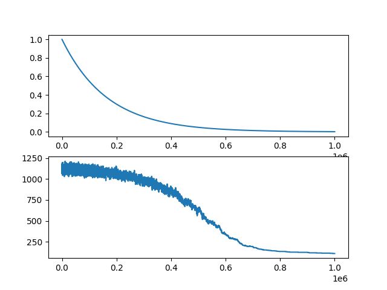

<div class="card">

<figure>
    
    <figcaption>Stan początkowy</figcaption>
</figure>

<figure>
    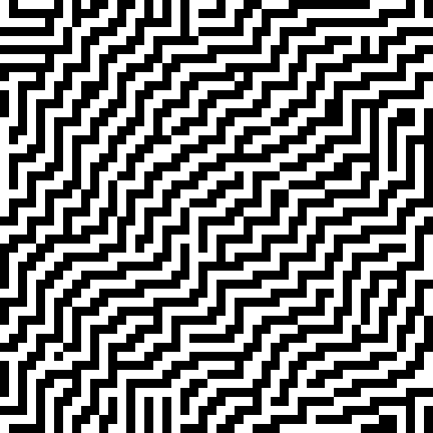
    <figcaption>Stan końcowy</figcaption>
</figure>

<figure>
    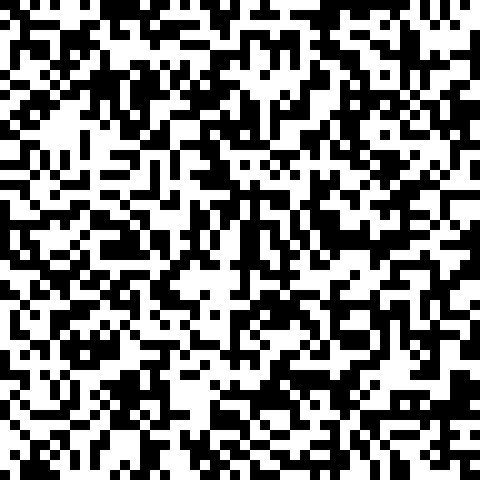
    <figcaption>GIF</figcaption>
</figure>

</div>

### Big Ring:

Sąsiedztwo:

```
X X X X X X X X X
X O O O O O O O X
X O X X X X X O X
X O X O O O X O X
X O X O @ O X O X
X O X O O O X O X
X O X X X X X O X
X O O O O O O O X
X X X X X X X X X
```

Wykres energi i temperatury

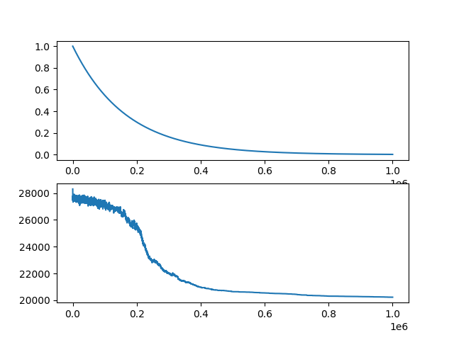

<div class="card">

<figure>
    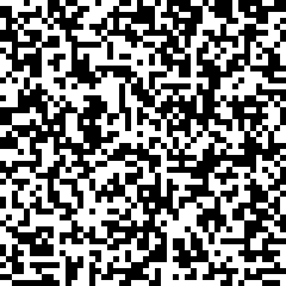
    <figcaption>Stan początkowy</figcaption>
</figure>

<figure>
    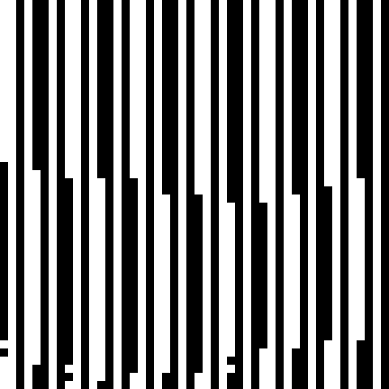
    <figcaption>Stan końcowy</figcaption>
</figure>

<figure>
    
    <figcaption>GIF</figcaption>
</figure>

</div>

Podobnie jak w przypadku pojedynczego pierścienia optimum zdają się być poziome lub pionowe paski, o róznych grubościach, zakłócenie w dolnej częsci obrazka zdaję się zmieniać kolejność pasków grubych i chudych.

### Cross with spaces:

Sąsiedztwo:

```
O O O O X O O O O
O O O O O O O O O
O O O O X O O O O
O O O O O O O O O
X O X O @ O X O X
O O O O O O O O O
O O O O X O O O O
O O O O O O O O O
O O O O X O O O O
```

Wykres energi i temperatury

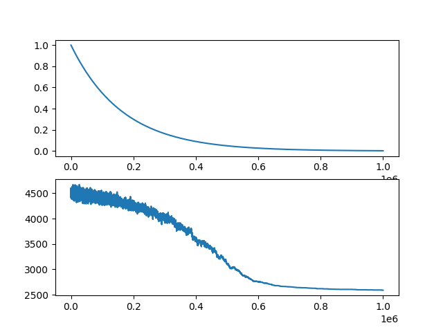

<div class="card">

<figure>
    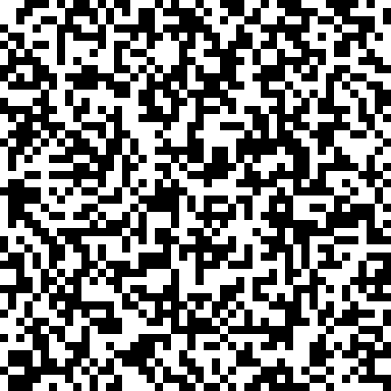
    <figcaption>Stan początkowy</figcaption>
</figure>

<figure>
    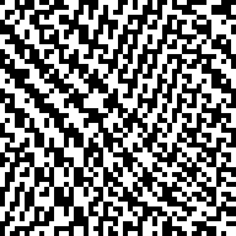
    <figcaption>Stan końcowy</figcaption>
</figure>

<figure>
    
    <figcaption>GIF</figcaption>
</figure>

</div>

### Wnioski obrazy czarno-białe

Jak widać wszystkie uzyskane wzory są bardzo wyraźne, mimo tego że posiadają zakłócenia. W większości przypadków da się na ich podstawie wywnioskować jak wyglądało by idealne minimum globalne.

Zakłócenia są bardzo ciekawe gdyż często można zauważyć następujący schemat:
- W dwóch różnych partiach obrazu powstają wzory będące bliskie minimum globalnego, rózniące się niewiele od siebie
- Punkty wokół tych wzorów zaczynają dopasowywać się do owych kształtów
- Gdy wszytskie punkty należą do jednej z grup (wzór pierwszy i wzór drugi) to układ jest już zbyt chłodny by móc je połączyć w jeden wzór (zniszczenie jednego z tych wzorów jest zbyt dużym skokiem energi potencjalnej aby zaakceptować ten stan, nawet jeśli prowadziło by to do lepszego rozwiązania)

Z wykresów energi i temperatury widać także, że gdy układ jest "rozgrzany" to skoki energi potencjalnej są większe niż gdy układ jest "chłodny". Pokazuje to dlaczego ten algorytm może się kojarzyć wyżarzaniem w metallurgi.

### RGB Repel:

Sąsiedztwo:

```
X X X
X @ X
X X X
```

Zasady:
- Piksele tego samego koloru przyciągają się nawzajem
- Piksele czerwone i zielone przyciągają się nawzajem
- Piskele niebieskie odpychają piksele zielone i czerwone

Wykres energi i temperatury

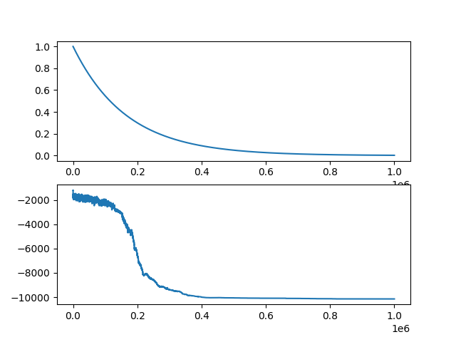

<div class="card">

<figure>
    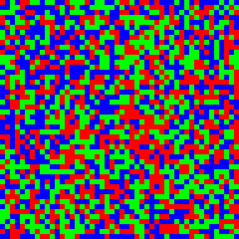
    <figcaption>Stan początkowy</figcaption>
</figure>

<figure>
    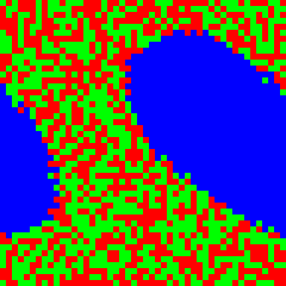
    <figcaption>Stan końcowy</figcaption>
</figure>

<figure>
    
    <figcaption>GIF</figcaption>
</figure>

</div>

Bardzo ładnie widać, że obraz jest "zawinięty" na krawędziach np. wychodząc z lewej strony wchodzimy z prawej.

### Green Random:

Sąsiedztwo:

```
O O O O O X O
O O X O O O O
O O O O O O O
O O O @ O X O
O X O O O O O
O O O X O O O
O O O O O O O
```

Siła przyciągania jest tym większa im mniejsza jest róznica w wartości koloru zielonego dla piksela. Jasne piksele przyciągają się mocniej do jasnych, ciemne do ciemnych.

Wykres energi i temperatury

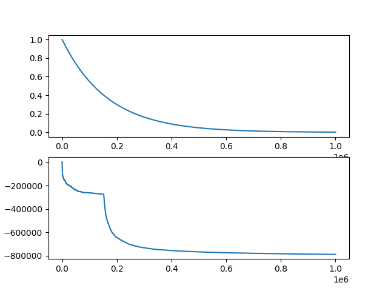

<div class="card">

<figure>
    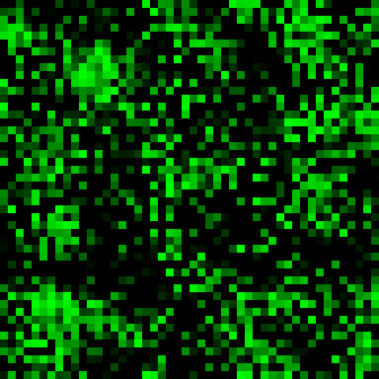
    <figcaption>Stan początkowy</figcaption>
</figure>

<figure>
    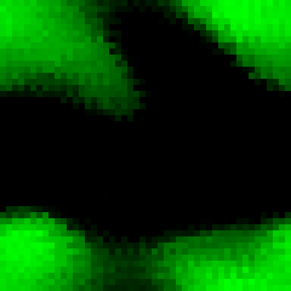
    <figcaption>Stan końcowy</figcaption>
</figure>

<figure>
    
    <figcaption>GIF</figcaption>
</figure>

</div>

Widać zawinięcie mapy, oraz zgodnie z oczekiwaniami jasne piksele tworzą wyspy otoczone przez mniej ciemne, otoczone przez prawie czarne.

Poniższe obrazy mają analogiczne zasady przciągania jak ten.

### Red Square:

Sąsiedztwo:

```
X X X
X @ X
X X X
```

Wykres energi i temperatury

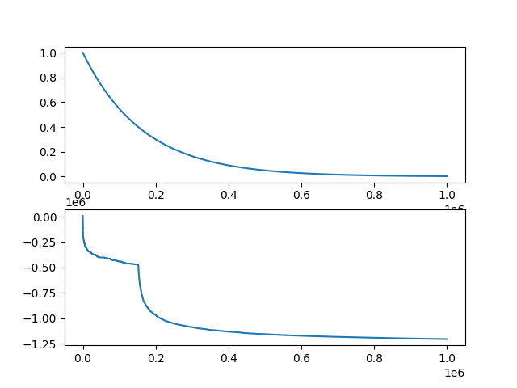

<div class="card">

<figure>
    
    <figcaption>Stan początkowy</figcaption>
</figure>

<figure>
    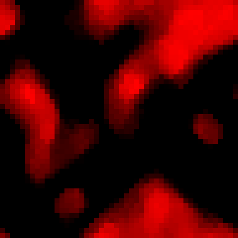
    <figcaption>Stan końcowy</figcaption>
</figure>

<figure>
    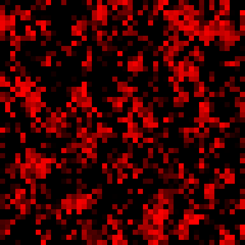
    <figcaption>GIF</figcaption>
</figure>

</div>

### Red ring:

Sąsiedztwo:

```
X X X X X
X O O O X
X O @ O X
X O O O X
X X X X X
```

Wykres energi i temperatury

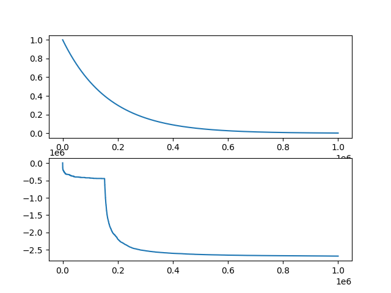

<div class="card">

<figure>
    
    <figcaption>Stan początkowy</figcaption>
</figure>

<figure>
    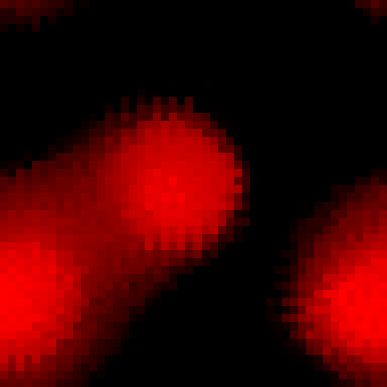
    <figcaption>Stan końcowy</figcaption>
</figure>

<figure>
    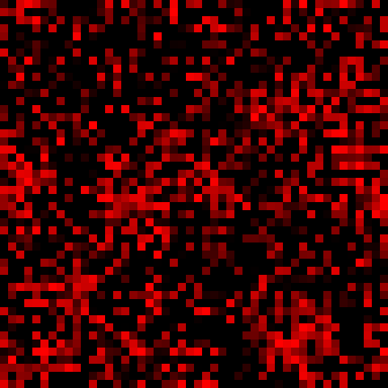
    <figcaption>GIF</figcaption>
</figure>

</div>

### Red column:

Sąsiedztwo:

```
O X O X O
O O X O O
O O @ O O
O O X O O
O X O X O
```

Wykres energi i temperatury

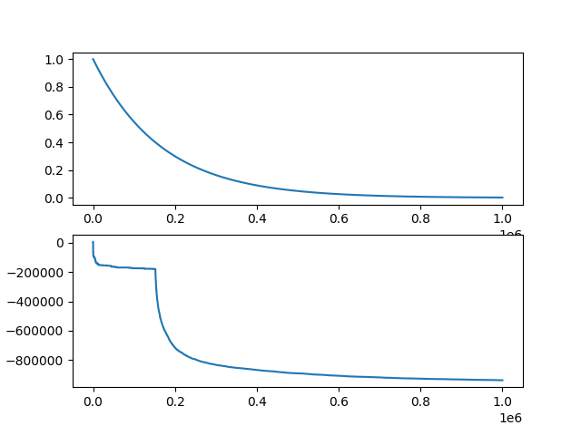

<div class="card">

<figure>
    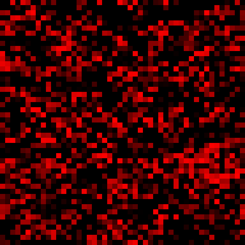
    <figcaption>Stan początkowy</figcaption>
</figure>

<figure>
    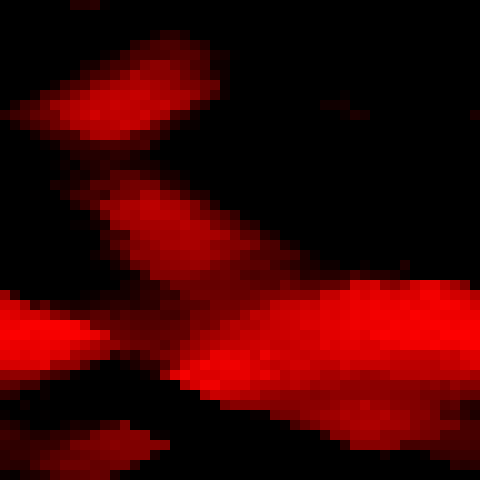
    <figcaption>Stan końcowy</figcaption>
</figure>

<figure>
    
    <figcaption>GIF</figcaption>
</figure>

</div>

### Blue random:

Sąsiedztwo:

```
O O O X O O O
O O X O O O O
O O O O O O O
O O O @ O X O
O O O O O O O
O O O X O O O
O O O O O O O
```

Wykres energi i temperatury

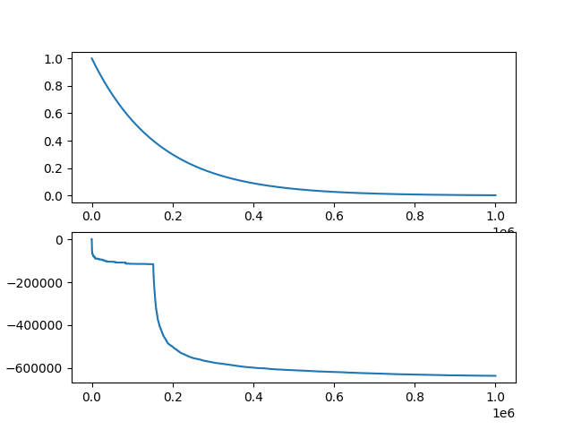

<div class="card">

<figure>
    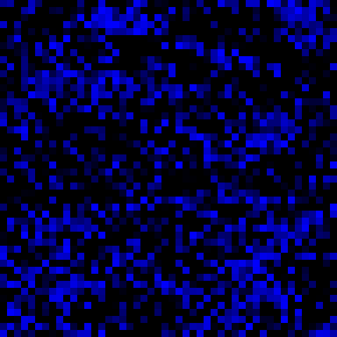
    <figcaption>Stan początkowy</figcaption>
</figure>

<figure>
    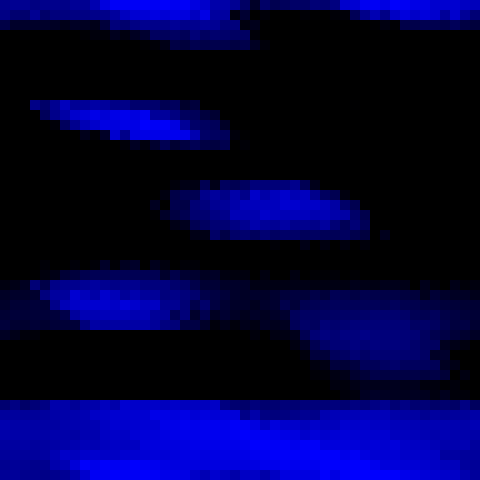
    <figcaption>Stan końcowy</figcaption>
</figure>

<figure>
    
    <figcaption>GIF</figcaption>
</figure>

</div>

### Blue Horn:

Sąsiedztwo:

```
X O X
O @ O
X O X
```

Wykres energi i temperatury

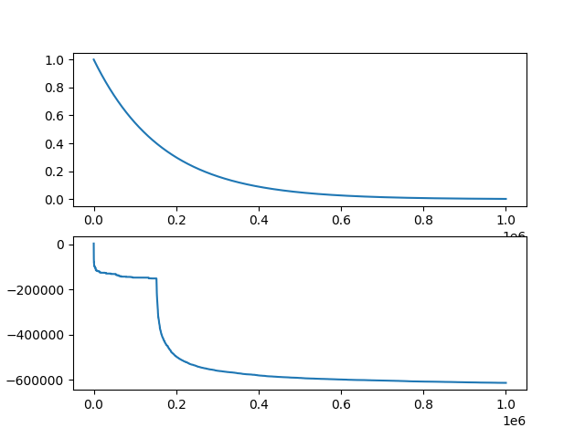

<div class="card">

<figure>
    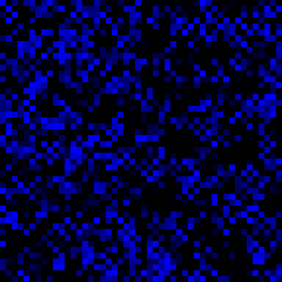
    <figcaption>Stan początkowy</figcaption>
</figure>

<figure>
    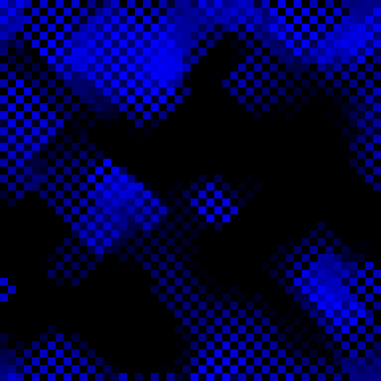
    <figcaption>Stan końcowy</figcaption>
</figure>

<figure>
    
    <figcaption>GIF</figcaption>
</figure>

</div>

### Wnioski obrazy RGB

Obrazy zachowują się tak jak można by przewidzieć. Warto jednak zauważyć, że obrazy te zdecydowanie wolniej zbiegają do optimum dla dużej ilości pikseli zmienianych naraz, zdecydowanie bardziej opłacałoby się zwiększyć próg temperatury dla którego ilość zmienianych pikseli jest większa.

## Zad3

Rozwiązywanie Sudoku

### Klasa Sudoku

```Python
class Sudoku(Node):

    def numToInsert(self, xOffset, yOffset):
        usedNum = []
        for i in range(3):
            for j in range(3):
                x = i + 3*xOffset
                y = j + 3*yOffset
                if self.points[y][x] != 0:
                    usedNum.append(self.points[y][x])
        newNum = []
        for i in range(1,10):
            if i not in usedNum:
                newNum.append(i)
        return newNum


    def __init__(self, points):
        self.n = 9
        self.points = points
        self.stack = []
        self.map = {}
        for i in range(9):
            for j in range(9):
                if self.points[i][j] != 0:
                    self.map[(i,j)] = True


        for xOffset in range(3):
            for yOffset in range(3):
                newNum = self.numToInsert(xOffset, yOffset)
                for i in range(3):
                    for j in range(3):
                        x = i + 3*xOffset
                        y = j + 3*yOffset
                        if self.points[y][x] == 0:
                            num = newNum.pop()
                            self.points[y][x] = num

    def getEnergy(self):
        res = 0
        for i in range(self.n):
            mapa = {}
            for j in range(self.n):
                if mapa.get(self.points[i][j]) == None:
                    mapa[self.points[i][j]] = True
                else:
                    res += 1
        for i in range(self.n):
            mapa = {}
            for j in range(self.n):
                if mapa.get(self.points[j][i]) == None:
                    mapa[self.points[j][i]] = True
                else:
                    res += 1
        return res

    def neighbour(self, temp):
        while (1):
            xOffset = random.randint(0,2)
            yOffset = random.randint(0,2)

            x1 = random.randint(0,2)
            y1 = random.randint(0,2)
            x2 = random.randint(0,2)
            y2 = random.randint(0,2)

            x1 = x1 + 3*xOffset
            y1 = y1 + 3*yOffset
            x2 = x2 + 3*xOffset
            y2 = y2 + 3*yOffset

            if self.map.get((y1,x1)) == None and self.map.get((y2,x2)) == None:
                break

        self.stack.append((x1,y1,x2,y2))
        # swap
        self.points[y1][x1], self.points[y2][x2] = self.points[y2][x2], self.points[y1][x1]

    def acceptState(self):
        while self.stack != []:
            self.stack.pop()

    def prevState(self):
        while self.stack != []:
            x1,y1,x2,y2 = self.stack.pop()
            self.points[y1][x1], self.points[y2][x2] = self.points[y2][x2], self.points[y1][x1]

    def screenShot(self):
        newMatrix = copy.deepcopy(self.points)
        return newMatrix

    def newStartPoint(self):
        return self

def printRes(nodes):
    # for node in nodes:
    node = nodes[len(nodes)-1]
    n = len(node)
    for i in range(n):
        if i % 3 == 0 and i != 0:
            print("------+-------+------")
        for j in range(n):
            if j % 3 == 0 and j != 0:
                print("|", end=" ")
            print(node[i][j], end=" ")
        print()
```

Sposób generowania stanu sąsiedniego polega na wybraniu losowego kwadratu 3x3 i zamiany miejscami dwóch losowych liczb, nie będących liczbami ustalonymi od początku.

## Wyniki zad 3

Wszystkie sudoku zostały wygenrowane na stronie [](https://sudoku.com/pl). Wszystkie sudoku są poziomu "Diabelska".

Do obliczenia wyniku użyłem opcji

- Iterations = 150000
- restarts = 20
- startingTemp = 1
- timeFactor = 4000
- probFactor = 1

### Sudoku nr 1

Wykres:

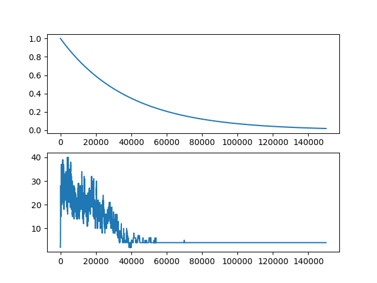

Stan początkowy:
```
0 0 9 | 0 8 0 | 5 0 2 
0 0 0 | 0 0 0 | 0 0 4 
8 0 0 | 6 0 0 | 0 0 0 
------+-------+------ 
0 0 0 | 0 0 0 | 0 7 0 
0 1 0 | 0 0 3 | 0 0 0 
0 0 2 | 0 6 0 | 9 0 8 
------+-------+------ 
0 0 0 | 0 5 0 | 0 4 0 
0 0 7 | 0 0 0 | 0 6 0 
0 2 0 | 1 0 0 | 7 0 5
```

Stan końcowy:
```
7 6 9 | 3 8 4 | 5 1 2
2 3 1 | 5 9 7 | 6 8 4
8 4 5 | 6 1 2 | 3 9 7
------+-------+------
6 9 4 | 8 2 5 | 1 7 3
5 1 8 | 9 7 3 | 4 2 6
3 7 2 | 4 6 1 | 9 5 8
------+-------+------
1 8 3 | 7 5 6 | 2 4 9
4 5 7 | 2 3 9 | 8 6 1
9 2 6 | 1 4 8 | 7 3 5
```
### Sudoku nr 2

Stan początkowy:

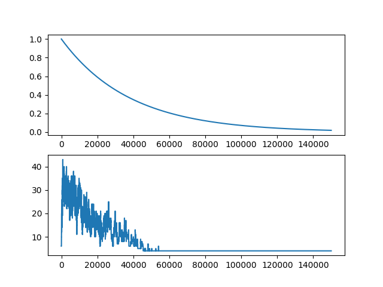

```
9 0 0 | 0 0 8 | 4 0 0 
4 0 3 | 0 0 0 | 0 5 0 
0 0 0 | 0 7 9 | 2 0 0
------+-------+------
0 5 0 | 0 0 0 | 0 4 0
0 0 0 | 6 0 0 | 0 0 1
0 0 0 | 0 0 0 | 0 0 0
------+-------+------
3 0 7 | 0 0 0 | 0 2 0
1 0 0 | 0 0 6 | 0 0 0
0 0 2 | 0 4 5 | 0 8 0
```

Stan końcowy:
```
7 6 9 | 3 8 4 | 5 1 2
2 3 1 | 5 9 7 | 6 8 4
8 4 5 | 6 1 2 | 3 9 7
------+-------+------
6 9 4 | 8 2 5 | 1 7 3
5 1 8 | 9 7 3 | 4 2 6
3 7 2 | 4 6 1 | 9 5 8
------+-------+------
1 8 3 | 7 5 6 | 2 4 9
4 5 7 | 2 3 9 | 8 6 1
9 2 6 | 1 4 8 | 7 3 5
```

### Sudoku nr 3

Stan początkowy:

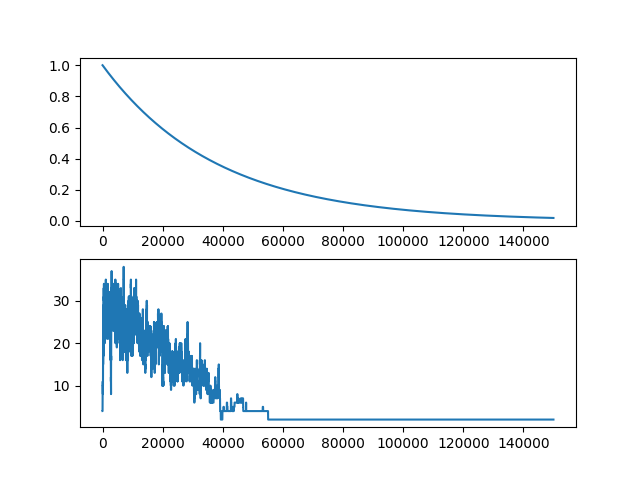

```
0 0 0 | 0 0 4 | 0 0 2 
6 0 0 | 0 0 0 | 0 0 0 
9 0 5 | 0 2 0 | 0 3 0
------+-------+------
0 0 0 | 8 0 0 | 7 0 0
2 0 3 | 0 4 0 | 0 9 0
0 1 0 | 0 0 0 | 0 0 0
------+-------+------
5 0 1 | 0 0 7 | 9 0 0
0 6 0 | 0 5 0 | 0 0 0
0 4 0 | 0 0 0 | 0 1 0
```

Stan końcowy:
```
1 3 8 | 9 7 4 | 6 5 2
6 2 4 | 1 3 5 | 8 7 9
9 7 5 | 6 2 8 | 4 3 1
------+-------+------
4 9 6 | 8 1 3 | 7 2 5
2 5 3 | 7 4 6 | 1 9 8
8 1 7 | 5 9 2 | 3 6 4
------+-------+------
5 8 1 | 2 6 7 | 9 4 3
3 6 9 | 4 5 1 | 2 8 7
7 4 2 | 3 8 9 | 5 1 6
```
### Wnioski Zad3

Jak widać algorytm jest w stanie wygenerować dokładne rozwiązania potrzebuje on jednak dużej ilości restartów aby nie utknąć na optimum lokalnym.

## Program upscaler

Niestety podczas pisania programu nie wykazałem się należytą dalekowzrocznością i wszystkie obrazy, które powstały po dziesiątkach godzin obliczeń były rozmiaru 48x48 pikseli. Nie nadawały się więc na umieszczenie w raporcie gdyż byłby one po prostu nie wyraźne (tak przynajmniej skalowała te zdjęcia moja przeglądarka oraz eksplorator plików windows). Dlatego aby naprawić swój błąd stowrzyłem program *upscaler*, który jako argument przyjmuje ścieżkę do folderu z zdjęciami, następnie je powiększa i tworzy nowy plik gif.